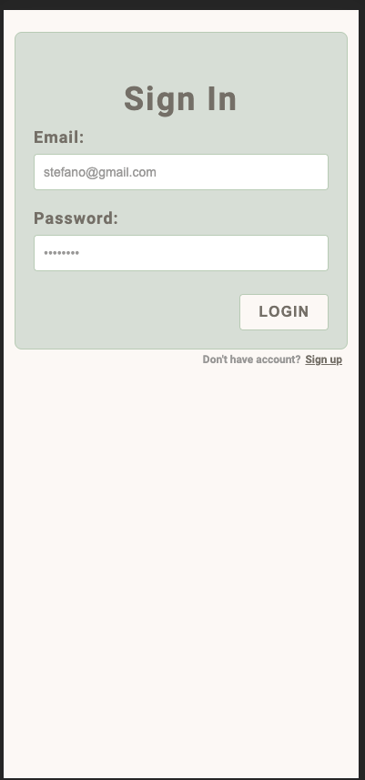
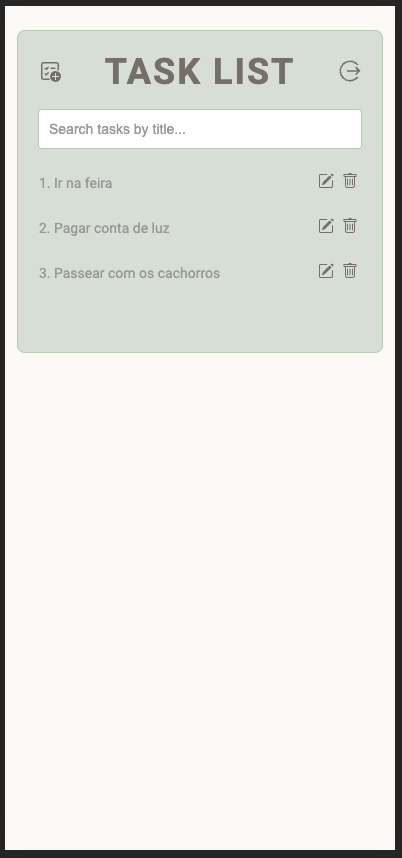
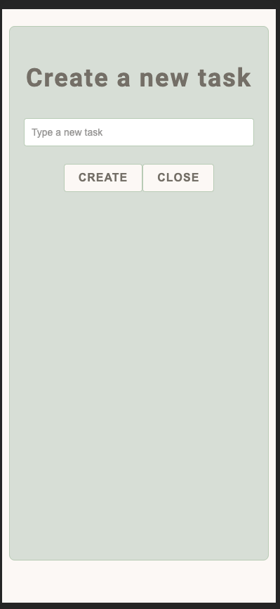
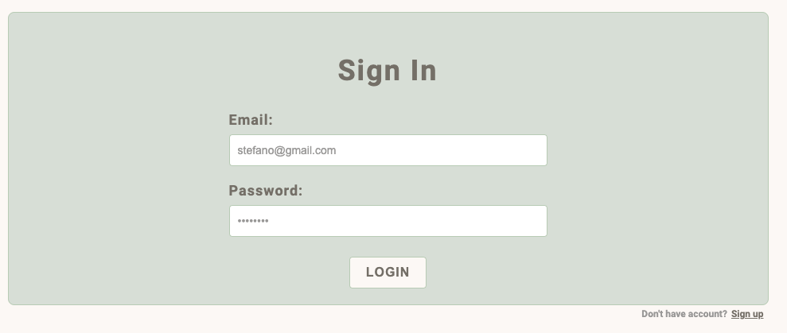
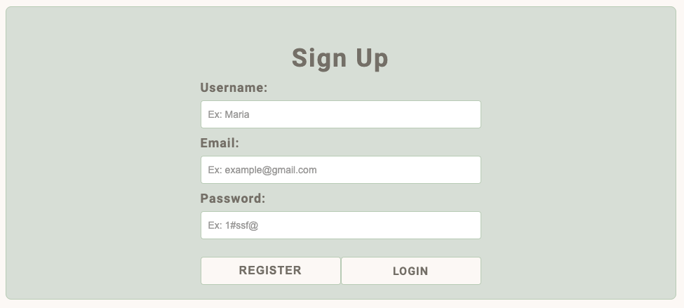
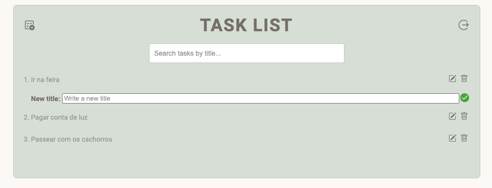
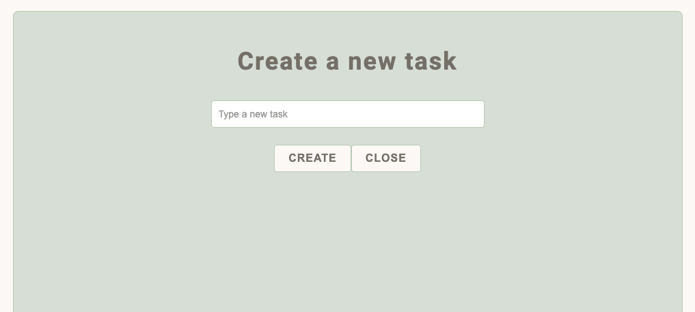

[](https://tbi.taniabulhoes.com.br/)

<h1 align="center">
    TETE FULL STACK DEVELOPER
</h1>

<h4 align="center"> 
	STEFANO BRANZ
</h4>

<p align="center">
 <a href="#-sobre-o-projeto">Sobre</a> •
 <a href="#-funcionalidades">Funcionalidades</a> •
 <a href="#-layout">Layout</a> • 
 <a href="#-como-executar-o-projeto">Como executar</a> • 
 <a href="#-tecnologias">Tecnologias</a> •
 <a href="#-licença">Licença</a>
</p>


## 💻 Sobre o projeto
<div id="-sobre-o-projeto"></div>

Esse é um projeto de To Do List, criado para o processo seletivo da Tania Bulhões.

O projeto consiste em um aplicativo com login e autorização para poder acessar a lista de tarefas, podendo editar, deletar ou até mesmo criar novas tarefas para determinado usuário.


---

## ⚙️ Funcionalidades
<div id="-funcionalidades"></div>

- [x] Listagem de tarefas
- [x] Criação de nova tarefa
- [x] Edição e exclusão de tarefa
- [x] Exibir alerta de confirmação de exclusão
- [x] Exibir Toaster feedbacks para erros que acontecerem na aplicação
- [x] Utilizar alguma estrutura para gerenciamento de estado global da aplicação (Context API, Redux, Hooks, etc)
- [x] OAuth via JWT token no fluxo de login do usuário
- [x] Autenticação JWT token em todos os endpoints privados da API


  <b>Desejáveis:<b>
  - [x]Utilizar NextJS para o desenvolvimeto do frontend da aplicação
  - [x]Tela de cadastro de usuário com os seguintes campos:
    - Nome
    - E-mail
    - Senha
  - [x] Campo de busca de tarefas (por título) na tela de listagem
  - [] Testes unitários
  - [x] Link hospedado para homologação (Pode ser um preview da Vercel, caso utilize o NextJS como framework para desenvolvimento)
  - [x] Todos os dados devem ser salvos em um banco de dados relacional de sua escolha.
  - [x] As telas privadas só podem ser acessadas na aplicação após login.

---

## 🎨 Layout
<div id="-layout"></div>

### Mobile

<p>
  

  

  

  
</p>

### Web

<p>
  

  

  

  
</p>

---

## 🚀 Como executar o projeto
<div id="-como-executar-o-projeto"></div>

Este projeto é divido em três partes:
1. Backend (pasta backend-todo-app) 
2. Frontend (pasta frontend-todo-app)
3. Banco de dados

💡O Frontend precisa que o Backend esteja sendo executado para funcionar.

### Pré-requisitos

#### Rodando o Backend (Backend)
OBS: caso queira pode acessar o servidor remoto. Porém o banco de dados precisar rodar localmente, com variáveis de ambiente correspondentes.
[SERVIDOR](https://test-fullstack-developer-server.onrender.com)

```bash

# Vá para a pasta do backend
$ cd backend-todo-app

# Instale as dependências
$ npm install

# Configure .env
$ na raiz do projeto crie um arquivo .env com os seguintes dados:
$DATABASE_URL=URL BANDO DE DADOS
$JWT_SECRET=SEGREDO JWT TOKEN
$PORT=PORTA SERVIDOR
$POSTGRES_PORT=PORTA BANCO DE DADOS
$POSTGRES_DATABASE_NAME=NOME DO BANDO DE DADOS
$POSTGRES_USER=USUÁRIO BANDO DE DADOS
$POSTGRES_PASSWORD=SENHA BANDO DE DADOS

# Execute a aplicação
$ node server.js

# O servidor inciará na porta:2000 - acesse http://localhost:2000/api/status para checar o funcionamento. 

```

```bash
# cURL's API Postman
## LOGIN USUÁRIO::
curl --location 'http://localhost:2000/api/users/login' \
--header 'Content-Type: application/json' \
--data-raw '{
    "userEmail": "User email",
    "password": "User password"
}'

## CRIAR NOVO USUÁRIO: 
curl --location 'http://localhost:2000/api/users/register' \
--header 'Content-Type: application/json' \
--data-raw '{
    "userName": "User name",
    "password": "User password",
    "userEmail": "User email"
}'

## CRIAR NOVO USUÁRIO: 
curl --location 'http://localhost:2000/api/users/login' \
--header 'Content-Type: application/json' \
--data-raw '{
    "userEmail": "User email",
    "password": "User password"
}'

## LISTAR TAREFAS: 
curl --location 'http://localhost:2000/api/tasks/user-tasks?userId={User ID}' \
--header 'Authorization: JWT TOKEN' \
--data ''

## CRIAR TAREFA: 
curl --location 'http://localhost:2000/api/tasks/create' \
--header 'Authorization: JWT TOKEN' \
--header 'Content-Type: application/json' \
--data '{
    "userId": "User ID",
    "title": "Título da tarefa"
}'

## EDITAR TAREFA: 
curl --location --request PUT 'http://localhost:2000/api/tasks/edit' \
--header 'Content-Type: application/json' \
--data '{
    "taskId": "ID Tarefa",
    "newTitle": "Novo Título",
    "userId": "ID Usuário"
}'

## DELETAR TAREFA: 
curl --location --request DELETE 'http://localhost:2000/api/tasks/delete' \
--header 'Content-Type: application/json' \
--data '{
    "taskId": "ID Tarefa",
    "userId": "ID usuário"
}'


```


#### Rodando a aplicação web (Frontend)
OBS: Caso queira pode acessar o site remoto. Porém o banco de dados precisar rodar localmente, com variáveis de ambiente correspondentes.
[FRONTEND](https://test-fullstack-developer-ng0ifs8ix-stefano020.vercel.app/)

```bash

# Vá para a pasta da aplicação Front End
$ cd frontend-todo-app

# Instale as dependências
$ npm install

# Configure .env
$ na raiz do projeto crie um arquivo .env com o seguinte dado:
$NEXT_PUBLIC_API_URL=URL SERVIDOR/api

# Execute a aplicação em modo de desenvolvimento
$ npm run dev

# A aplicação será aberta na porta:3000 - acesse http://localhost:3000

```

#### Baixando banco de dados (PostgreSQL 16)

```bash
# baixe o postgreSQL no site oficial https://www.postgresql.org/

# Crie uma tabela com um nome de sua escolha, mas lembre de colocar o nome correto no .env do servidor.

# Crie uma tabela chamada "users" e crie as colunas:
$ CREATE TABLE IF NOT EXISTS public.users
(
    id integer NOT NULL DEFAULT nextval('users_id_seq'::regclass),
    name character varying(40) COLLATE pg_catalog."default" NOT NULL,
    email text COLLATE pg_catalog."default" NOT NULL,
    password character(8) COLLATE pg_catalog."default" NOT NULL,
    CONSTRAINT users_pkey PRIMARY KEY (id)
)

TABLESPACE pg_default;

ALTER TABLE IF EXISTS public.users
    OWNER to postgres;

# Crie uma tabela chamada "tasks" e crie as colunas:
$ CREATE TABLE IF NOT EXISTS public.tasks
(
    id integer NOT NULL DEFAULT nextval('tasks_id_seq'::regclass),
    title text COLLATE pg_catalog."default" NOT NULL,
    user_id integer NOT NULL,
    CONSTRAINT tasks_pkey PRIMARY KEY (id),
    CONSTRAINT user_id FOREIGN KEY (user_id)
        REFERENCES public.users (id) MATCH SIMPLE
        ON UPDATE NO ACTION
        ON DELETE NO ACTION
)

TABLESPACE pg_default;

ALTER TABLE IF EXISTS public.tasks
    OWNER to postgres;

```

---

## 🛠 Tecnologias
<div id="-tecnologias"></div>

As seguintes ferramentas foram usadas na construção do projeto:

#### **Website**  ([React](https://reactjs.org/)  +  [TypeScript](https://www.typescriptlang.org/) + [TypeScript](https://nextjs.org/))

-   **[Axios](https://github.com/axios/axios)**

-   **[jsonwebtoken](https://jwt.io/introduction)**


#### **Server**  ([NodeJS](https://nodejs.org/en/))

-   **[Express](https://expressjs.com/)**

-   **[CORS](https://expressjs.com/en/resources/middleware/cors.html)**

-   **[dotENV](https://www.dotenv.org/)**

-   **[jsonwebtoken](https://jwt.io/introduction)**

-   **[pg-promise](https://github.com/vitaly-t/pg-promise)**

- **[postgreSQL](https://www.postgresql.org/)**

---

## 📝 Licença
<div id="-licença"></div>

Este projeto esta sobe a licença [MIT](./LICENSE).

Feito  por Stefano Branz [Entre em contato!](https://www.linkedin.com/in/stefano-branz/)

---